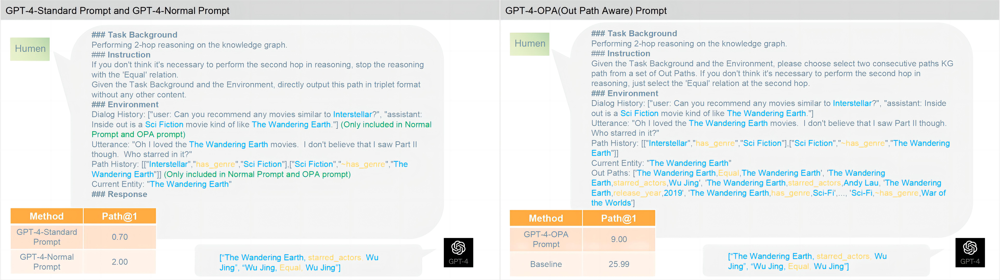
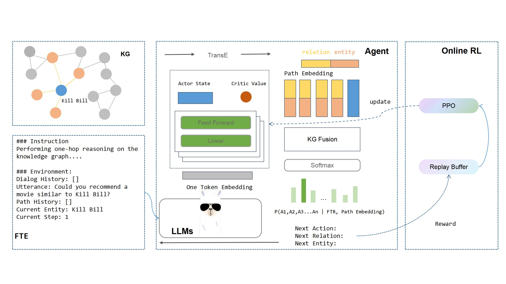

# LLM-ARK
This repository provide an implementation of LLM-ARK, which is described in this paper:

[Evaluating and Enhancing Large Language Models for Conversational Reasoning on Knowledge Graphs](https://arxiv.org/abs/2312.11282)

Yuxuan Huang

#### Motivating example:



#### LLM-ARK architecture:


## Usage
1. Clone this project, install dependency packages and Pytorch >= 2.0.0.
```
git clone https://github.com/Airoura/LLM-ARK.git
cd LLM-ARK
pip3 install -r requirements.txt
```

2. Process OpenDialKG raw data:
```
git clone https://github.com/facebookresearch/opendialkg.git
python ./tools/process_opendialkg_conv_data.py
python ./tools/process_opendialkg_kg_data.py
cp datasets/OpenDialKG/Conversation/sub_triples.txt datasets/OpenDialKG/Graph
```

3. Process data for TransE training:
```
python ./tools/process_llm_ark_transe_data.py
git clone https://github.com/thunlp/OpenKE.git
cp tools/train_transe_OpenDialKG.py OpenKE/
cd OpenKE/openke 
bash make.sh
cd ../
python ./train_transe_OpenDialKG.py
cd ../
```

4. Make dataset for our model:
```
python tools/process_llm_ark_train_data.py

```

5. Train
```
bash scripts/train_llama2_7b_type_1.sh
```

6. Test
```
bash scripts/test_llama2_7b_type_1.sh
```

You can modify the hyperparameters yourself to perform ablation experiments.

## Datasets and Checkpoints
- [OneDrive](https://1drv.ms/u/s!Ag89Dbur-oW3fHOM1FpqixT_syI?e=xtX9Ah)
- [BaiduNetdisk](https://pan.baidu.com/s/1IeRWtf88WyL4T9kdtzjjdA?pwd=wdds)

The data and checkpoints in the netdisk are produced by executing steps 2, 3, and 4 of the Usage section. Putting them directly into the project root directory may save you a lot of time!


## Reference
To cite this work please use:
```
@misc{huang2024evaluating,
      title={Evaluating and Enhancing Large Language Models for Conversational Reasoning on Knowledge Graphs}, 
      author={Yuxuan Huang},
      year={2024},
      eprint={2312.11282},
      archivePrefix={arXiv},
      primaryClass={cs.CL}
}
```

## License
LLM-ARK is released under [Apache-2.0 license](https://www.apache.org/licenses/LICENSE-2.0), see [LICENSE](https://github.com/Airoura/LLM-ARK/blob/main/LICENSE) for details.
